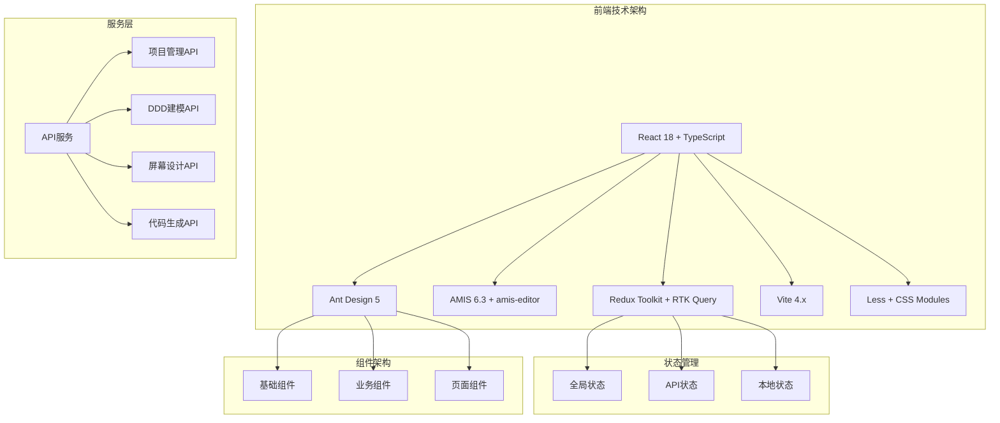
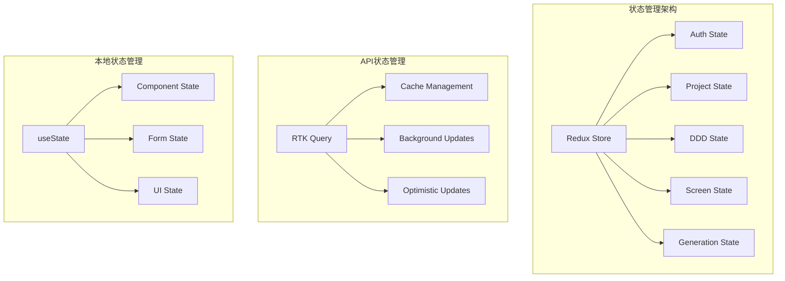

# DDD驱动开发平台前端 - 架构设计文档

## 📐 架构概述

### 设计原则
- **DDD驱动**：基于领域驱动设计的架构设计
- **模块化**：清晰的模块边界和职责分离
- **可扩展**：支持功能扩展和性能优化
- **可维护**：清晰的代码结构和文档
- **高性能**：优化的渲染和数据处理
- **用户友好**：直观的界面设计和交互体验

### 技术架构



## 🏗️ 8层分层架构详解

### 第一层：项目管理层（Project Management Layer）

#### 职责
- 项目生命周期管理
- 项目成员和权限管理
- 项目模板和配置管理

#### 核心组件
```typescript
// 项目工作台
interface ProjectWorkspace {
  projectOverview: ProjectOverview;      // 项目概览
  recentProjects: Project[];            // 最近项目
  quickStart: QuickStartGuide;          // 快速开始
}

// 项目设置
interface ProjectSettings {
  basicInfo: ProjectBasicInfo;          // 基本信息
  members: ProjectMember[];             // 项目成员
  permissions: Permission[];           // 权限配置
  templates: ProjectTemplate[];         // 项目模板
}
```

#### 实现方案
- **状态管理**：使用Redux Toolkit管理项目状态
- **API集成**：通过RTK Query与后端API交互
- **权限控制**：基于角色的权限控制（RBAC）
- **模板系统**：可复用的项目模板库

### 第二层：统一语言层（Ubiquitous Language Layer）

#### 职责
- 业务术语和概念管理
- 业务规则和约束定义
- 统一语言术语库维护

#### 核心组件
```typescript
// 业务术语管理
interface BusinessTermsManager {
  terms: BusinessTerm[];                // 业务术语
  definitions: TermDefinition[];        // 术语定义
  relationships: TermRelationship[];   // 术语关系
}

// 业务规则定义
interface BusinessRulesDesigner {
  rules: BusinessRule[];               // 业务规则
  specifications: Specification[];     // 规格模式
  policies: Policy[];                  // 策略模式
  invariants: Invariant[];             // 不变量
}
```

#### 实现方案
- **术语库**：可搜索的业务术语数据库
- **关系图**：可视化的术语关系图
- **规则引擎**：业务规则验证和执行引擎
- **版本管理**：术语和规则的版本控制

### 第三层：战略设计层（Strategic Design Layer）

#### 职责
- 领域识别和分类
- 限界上下文设计
- 上下文映射关系管理

#### 核心组件
```typescript
// 领域识别
interface DomainIdentification {
  domains: Domain[];                    // 领域列表
  domainTypes: DomainType[];           // 领域类型
  stakeholders: Stakeholder[];        // 利益相关者
  businessGoals: BusinessGoal[];       // 业务目标
}

// 限界上下文设计
interface BoundedContextDesigner {
  contexts: BoundedContext[];          // 限界上下文
  boundaries: ContextBoundary[];      // 上下文边界
  responsibilities: Responsibility[];  // 职责定义
}
```

#### 实现方案
- **可视化建模**：拖拽式领域建模工具
- **关系图**：领域和上下文关系图
- **分析工具**：领域分析和评估工具
- **文档生成**：自动生成领域文档

### 第四层：战术设计层（Tactical Design Layer）

#### 职责
- 聚合、实体、值对象设计
- 领域服务和事件设计
- 仓储接口设计

#### 核心组件
```typescript
// 聚合设计器
interface AggregateDesigner {
  aggregates: Aggregate[];             // 聚合列表
  aggregateRoots: AggregateRoot[];     // 聚合根
  aggregateBoundaries: AggregateBoundary[]; // 聚合边界
}

// 实体建模器
interface EntityModeler {
  entities: Entity[];                   // 实体列表
  entityAttributes: EntityAttribute[];  // 实体属性
  entityBehaviors: EntityBehavior[];    // 实体行为
  entityIdentities: EntityIdentity[];   // 实体标识
}
```

#### 实现方案
- **可视化设计器**：拖拽式聚合设计工具
- **代码生成**：自动生成实体和聚合代码
- **验证引擎**：聚合和实体验证规则
- **关系管理**：实体间关系管理

### 第五层：数据传输层（Data Transfer Layer）

#### 职责
- DTO定义和设计
- API接口设计
- 数据映射和转换

#### 核心组件
```typescript
// DTO设计器
interface DTODesigner {
  dtos: DTO[];                         // DTO列表
  dtoMappings: DTOMapping[];           // DTO映射
  dtoValidation: DTOValidation[];      // DTO验证
}

// API接口设计
interface APIDesigner {
  apis: API[];                         // API列表
  apiEndpoints: APIEndpoint[];         // API端点
  apiDocumentation: APIDocumentation[]; // API文档
}
```

#### 实现方案
- **接口设计器**：可视化API设计工具
- **文档生成**：自动生成API文档
- **测试工具**：API测试和验证工具
- **版本管理**：API版本控制

### 第六层：屏幕设计层（Screen Design Layer）

#### 职责
- 屏幕类型和模板管理
- 组件库管理
- 布局设计工具

#### 核心组件
```typescript
// 屏幕设计器
interface ScreenDesigner {
  screenTypes: ScreenType[];           // 屏幕类型
  screenTemplates: ScreenTemplate[];    // 屏幕模板
  screenPatterns: ScreenPattern[];     // 屏幕模式
}

// 组件库管理器
interface ComponentLibraryManager {
  components: Component[];              // 组件列表
  componentCategories: ComponentCategory[]; // 组件分类
  componentProperties: ComponentProperty[]; // 组件属性
}
```

#### 实现方案
- **拖拽设计器**：可视化屏幕设计工具
- **组件库**：可复用的组件库
- **模板系统**：屏幕模板管理
- **响应式设计**：多设备适配

### 第七层：AMIS映射层（AMIS Mapping Layer）

#### 职责
- DDD模型到AMIS Schema转换
- 组件属性映射
- 业务规则映射

#### 核心组件
```typescript
// DDD到AMIS转换器
interface DDDToAmisConverter {
  entityToComponent: EntityToComponentConverter; // 实体到组件转换
  aggregateToScreen: AggregateToScreenConverter; // 聚合到屏幕转换
  dtoToForm: DTOToFormConverter;       // DTO到表单转换
  repositoryToApi: RepositoryToApiConverter; // 仓储到API转换
}

// AMIS Schema生成器
interface AmisSchemaGenerator {
  schemaGenerator: SchemaGenerator;     // Schema生成器
  componentGenerator: ComponentGenerator; // 组件生成器
  layoutGenerator: LayoutGenerator;     // 布局生成器
}
```

#### 实现方案
- **转换引擎**：自动DDD到AMIS转换
- **映射规则**：可配置的映射规则
- **模板引擎**：AMIS Schema模板
- **验证工具**：Schema验证和检查

### 第八层：界面渲染层（Interface Rendering Layer）

#### 职责
- AMIS编辑器集成
- 实时预览功能
- 代码生成和测试

#### 核心组件
```typescript
// AMIS编辑器集成
interface AmisEditorIntegration {
  editor: AmisEditor;                   // AMIS编辑器
  componentLibrary: ComponentLibrary;   // 组件库
  propertyPanel: PropertyPanel;        // 属性面板
  canvas: Canvas;                       // 画布
}

// 实时预览系统
interface RealTimePreviewSystem {
  preview: Preview;                    // 预览器
  responsivePreview: ResponsivePreview; // 响应式预览
  devicePreview: DevicePreview;       // 设备预览
}
```

#### 实现方案
- **编辑器集成**：原生amis-editor集成
- **预览系统**：多设备实时预览
- **代码生成**：多框架代码生成
- **测试工具**：界面测试和验证

## 🔄 数据流设计

### 状态管理架构



### API服务架构

```typescript
// API服务配置
export const api = createApi({
  reducerPath: 'api',
  baseQuery: fetchBaseQuery({
    baseUrl: '/api',
    prepareHeaders: (headers, { getState }) => {
      const token = (getState() as RootState).auth.token;
      if (token) {
        headers.set('authorization', `Bearer ${token}`);
      }
      return headers;
    },
  }),
  tagTypes: [
    'Project',
    'Domain',
    'BoundedContext',
    'Aggregate',
    'Entity',
    'Screen',
    'Template',
    'GenerationTask',
  ],
  endpoints: (builder) => ({
    // 项目管理API
    getProjects: builder.query<PageResponse<ProjectMetadata>, { page?: number; size?: number }>({
      query: ({ page = 0, size = 10 }) => `projects?page=${page}&size=${size}`,
      providesTags: ['Project'],
    }),
    // ... 其他API端点
  }),
});
```

## 🎨 组件设计模式

### 1. 容器组件模式

```typescript
// 容器组件：负责数据获取和状态管理
const ProjectContainer: React.FC = () => {
  const { data: projects, loading, error } = useGetProjectsQuery();
  const [createProject] = useCreateProjectMutation();
  const [updateProject] = useUpdateProjectMutation();
  const [deleteProject] = useDeleteProjectMutation();
  
  const handleCreateProject = async (projectData: ProjectData) => {
    try {
      await createProject(projectData).unwrap();
      message.success('项目创建成功');
    } catch (error) {
      message.error('项目创建失败');
    }
  };
  
  return (
    <ProjectView
      projects={projects}
      loading={loading}
      error={error}
      onCreateProject={handleCreateProject}
      onUpdateProject={updateProject}
      onDeleteProject={deleteProject}
    />
  );
};

// 展示组件：负责UI渲染和用户交互
interface ProjectViewProps {
  projects: Project[];
  loading: boolean;
  error: string | null;
  onCreateProject: (data: ProjectData) => void;
  onUpdateProject: (data: ProjectData) => void;
  onDeleteProject: (id: string) => void;
}

const ProjectView: React.FC<ProjectViewProps> = ({
  projects,
  loading,
  error,
  onCreateProject,
  onUpdateProject,
  onDeleteProject,
}) => {
  const [isModalVisible, setIsModalVisible] = useState(false);
  const [editingProject, setEditingProject] = useState<Project | null>(null);
  
  const handleEdit = (project: Project) => {
    setEditingProject(project);
    setIsModalVisible(true);
  };
  
  const handleDelete = (id: string) => {
    Modal.confirm({
      title: '确认删除',
      content: '确定要删除这个项目吗？',
      onOk: () => onDeleteProject(id),
    });
  };
  
  return (
    <div>
      <div className="table-toolbar">
        <Button type="primary" onClick={() => setIsModalVisible(true)}>
          新建项目
        </Button>
      </div>
      
      <Table
        dataSource={projects}
        loading={loading}
        columns={[
          {
            title: '项目名称',
            dataIndex: 'name',
            key: 'name',
          },
          {
            title: '描述',
            dataIndex: 'description',
            key: 'description',
          },
          {
            title: '操作',
            key: 'action',
            render: (_, record) => (
              <Space>
                <Button type="link" onClick={() => handleEdit(record)}>
                  编辑
                </Button>
                <Button type="link" danger onClick={() => handleDelete(record.id)}>
                  删除
                </Button>
              </Space>
            ),
          },
        ]}
      />
      
      <ProjectModal
        visible={isModalVisible}
        project={editingProject}
        onCancel={() => {
          setIsModalVisible(false);
          setEditingProject(null);
        }}
        onOk={onCreateProject}
      />
    </div>
  );
};
```

### 2. 自定义Hook模式

```typescript
// 业务逻辑封装在自定义Hook中
const useProjectManagement = () => {
  const { data: projects, loading, error } = useGetProjectsQuery();
  const [createProject] = useCreateProjectMutation();
  const [updateProject] = useUpdateProjectMutation();
  const [deleteProject] = useDeleteProjectMutation();
  
  const handleCreateProject = async (projectData: ProjectData) => {
    try {
      await createProject(projectData).unwrap();
      message.success('项目创建成功');
    } catch (error) {
      message.error('项目创建失败');
    }
  };
  
  const handleUpdateProject = async (projectData: ProjectData) => {
    try {
      await updateProject(projectData).unwrap();
      message.success('项目更新成功');
    } catch (error) {
      message.error('项目更新失败');
    }
  };
  
  const handleDeleteProject = async (id: string) => {
    try {
      await deleteProject(id).unwrap();
      message.success('项目删除成功');
    } catch (error) {
      message.error('项目删除失败');
    }
  };
  
  return {
    projects,
    loading,
    error,
    handleCreateProject,
    handleUpdateProject,
    handleDeleteProject,
  };
};

// 使用自定义Hook
const ProjectManagement: React.FC = () => {
  const {
    projects,
    loading,
    error,
    handleCreateProject,
    handleUpdateProject,
    handleDeleteProject,
  } = useProjectManagement();
  
  // 组件渲染逻辑
  return (
    <div>
      {/* 项目列表和操作 */}
    </div>
  );
};
```

### 3. 高阶组件模式

```typescript
// 权限控制高阶组件
interface WithPermissionProps {
  permission: string;
  fallback?: React.ReactNode;
}

const withPermission = <P extends object>(
  WrappedComponent: React.ComponentType<P>,
  permission: string,
  fallback?: React.ReactNode
) => {
  const WithPermissionComponent: React.FC<P> = (props) => {
    const { user } = useSelector((state: RootState) => state.auth);
    
    if (!user?.permissions.includes(permission)) {
      return fallback ? <>{fallback}</> : <AccessDenied />;
    }
    
    return <WrappedComponent {...props} />;
  };
  
  WithPermissionComponent.displayName = `withPermission(${WrappedComponent.displayName})`;
  
  return WithPermissionComponent;
};

// 使用高阶组件
const ProjectManagement = withPermission(
  ProjectManagementComponent,
  'project:manage',
  <div>您没有项目管理权限</div>
);
```

## 🔧 性能优化策略

### 1. 代码分割

```typescript
// 路由级别的代码分割
import { lazy, Suspense } from 'react';

const Project = lazy(() => import('@pages/Project'));
const DDD = lazy(() => import('@pages/DDD'));
const Screen = lazy(() => import('@pages/Screen'));

// 组件级别的代码分割
const AmisEditor = lazy(() => import('@components/AmisMapping/AmisEditor'));

// 使用Suspense包装
const App: React.FC = () => {
  return (
    <Suspense fallback={<Loading />}>
      <Routes>
        <Route path="/project/*" element={<Project />} />
        <Route path="/ddd/*" element={<DDD />} />
        <Route path="/screen/*" element={<Screen />} />
      </Routes>
    </Suspense>
  );
};
```

### 2. 缓存策略

```typescript
// RTK Query缓存配置
export const api = createApi({
  // ... 其他配置
  keepUnusedDataFor: 60, // 60秒后清理未使用的数据
  refetchOnMountOrArgChange: 30, // 30秒后重新获取数据
  refetchOnFocus: true, // 窗口获得焦点时重新获取
  refetchOnReconnect: true, // 网络重连时重新获取
});

// 组件级缓存
const ProjectList: React.FC = () => {
  const { data: projects } = useGetProjectsQuery(undefined, {
    // 缓存5分钟
    pollingInterval: 300000,
    // 跳过初始请求
    skip: false,
  });
  
  return (
    <div>
      {projects?.map(project => (
        <ProjectCard key={project.id} project={project} />
      ))}
    </div>
  );
};
```

### 3. 虚拟滚动

```typescript
import { FixedSizeList as List } from 'react-window';

const VirtualizedProjectList: React.FC<{ projects: Project[] }> = ({ projects }) => {
  const Row = ({ index, style }: { index: number; style: React.CSSProperties }) => (
    <div style={style}>
      <ProjectCard project={projects[index]} />
    </div>
  );
  
  return (
    <List
      height={600}
      itemCount={projects.length}
      itemSize={120}
      width="100%"
    >
      {Row}
    </List>
  );
};
```

### 4. 防抖和节流

```typescript
import { debounce, throttle } from 'lodash-es';

// 搜索防抖
const useDebouncedSearch = (searchTerm: string, delay: number = 300) => {
  const [debouncedSearchTerm, setDebouncedSearchTerm] = useState(searchTerm);
  
  useEffect(() => {
    const timer = setTimeout(() => {
      setDebouncedSearchTerm(searchTerm);
    }, delay);
    
    return () => clearTimeout(timer);
  }, [searchTerm, delay]);
  
  return debouncedSearchTerm;
};

// 滚动节流
const useThrottledScroll = (callback: () => void, delay: number = 100) => {
  const throttledCallback = useCallback(
    throttle(callback, delay),
    [callback, delay]
  );
  
  useEffect(() => {
    window.addEventListener('scroll', throttledCallback);
    return () => window.removeEventListener('scroll', throttledCallback);
  }, [throttledCallback]);
};
```

## 🛡️ 错误处理策略

### 1. 全局错误处理

```typescript
// 全局错误边界
interface ErrorBoundaryState {
  hasError: boolean;
  error: Error | null;
  errorInfo: ErrorInfo | null;
}

class ErrorBoundary extends React.Component<Props, ErrorBoundaryState> {
  constructor(props: Props) {
    super(props);
    this.state = { hasError: false, error: null, errorInfo: null };
  }
  
  static getDerivedStateFromError(error: Error): ErrorBoundaryState {
    return { hasError: true, error };
  }
  
  componentDidCatch(error: Error, errorInfo: ErrorInfo) {
    console.error('Error caught by boundary:', error, errorInfo);
    
    // 发送错误报告到监控系统
    if (process.env.NODE_ENV === 'production') {
      // 发送到Sentry或其他错误监控服务
      // Sentry.captureException(error, { extra: errorInfo });
    }
  }
  
  render() {
    if (this.state.hasError) {
      return <ErrorFallback error={this.state.error} />;
    }
    
    return this.props.children;
  }
}

// 错误回退组件
const ErrorFallback: React.FC<{ error: Error | null }> = ({ error }) => {
  const handleReload = () => {
    window.location.reload();
  };
  
  return (
    <div className="error-container">
      <div className="error-icon">⚠️</div>
      <div className="error-text">出现错误</div>
      <div className="error-description">
        {error?.message || '未知错误'}
      </div>
      <Button type="primary" onClick={handleReload}>
        重新加载
      </Button>
    </div>
  );
};
```

### 2. API错误处理

```typescript
// API错误处理中间件
const handleApiError = (error: any) => {
  if (error.status === 401) {
    // 未授权，跳转到登录页
    navigate('/login');
  } else if (error.status === 403) {
    // 权限不足
    message.error('权限不足');
  } else if (error.status >= 500) {
    // 服务器错误
    message.error('服务器错误，请稍后重试');
  } else {
    // 其他错误
    message.error(error.data?.message || '操作失败');
  }
};

// RTK Query错误处理
export const api = createApi({
  // ... 其他配置
  baseQuery: fetchBaseQuery({
    baseUrl: '/api',
    prepareHeaders: (headers, { getState }) => {
      const token = (getState() as RootState).auth.token;
      if (token) {
        headers.set('authorization', `Bearer ${token}`);
      }
      return headers;
    },
  }),
  // 全局错误处理
  tagTypes: ['Project', 'Domain', 'Aggregate'],
  endpoints: (builder) => ({
    // ... 端点定义
  }),
});

// 组件级错误处理
const ProjectManagement: React.FC = () => {
  const { data: projects, error, isLoading } = useGetProjectsQuery();
  
  if (error) {
    return <ErrorBoundary error={error} />;
  }
  
  if (isLoading) {
    return <Loading />;
  }
  
  return (
    <div>
      {projects?.map(project => (
        <ProjectCard key={project.id} project={project} />
      ))}
    </div>
  );
};
```

## 📱 响应式设计

### 1. 断点配置

```typescript
// 响应式断点配置
export const breakpoints = {
  xs: 0,
  sm: 576,
  md: 768,
  lg: 992,
  xl: 1200,
  xxl: 1600,
};

// 媒体查询Hook
const useMediaQuery = (query: string) => {
  const [matches, setMatches] = useState(false);
  
  useEffect(() => {
    const media = window.matchMedia(query);
    if (media.matches !== matches) {
      setMatches(media.matches);
    }
    
    const listener = () => setMatches(media.matches);
    media.addListener(listener);
    
    return () => media.removeListener(listener);
  }, [matches, query]);
  
  return matches;
};

// 使用示例
const ResponsiveComponent: React.FC = () => {
  const isMobile = useMediaQuery(`(max-width: ${breakpoints.md}px)`);
  const isTablet = useMediaQuery(`(min-width: ${breakpoints.md}px) and (max-width: ${breakpoints.lg}px)`);
  const isDesktop = useMediaQuery(`(min-width: ${breakpoints.lg}px)`);
  
  return (
    <div>
      {isMobile && <MobileLayout />}
      {isTablet && <TabletLayout />}
      {isDesktop && <DesktopLayout />}
    </div>
  );
};
```

### 2. 响应式布局

```typescript
// 响应式网格布局
const ResponsiveGrid: React.FC<{ children: React.ReactNode }> = ({ children }) => {
  return (
    <Row gutter={[16, 16]}>
      <Col xs={24} sm={12} md={8} lg={6} xl={4}>
        {children}
      </Col>
    </Row>
  );
};

// 响应式表格
const ResponsiveTable: React.FC<{ data: any[]; columns: any[] }> = ({ data, columns }) => {
  const isMobile = useMediaQuery(`(max-width: ${breakpoints.md}px)`);
  
  if (isMobile) {
    return (
      <div>
        {data.map((item, index) => (
          <Card key={index} style={{ marginBottom: 16 }}>
            {columns.map(column => (
              <div key={column.key}>
                <strong>{column.title}:</strong> {item[column.dataIndex]}
              </div>
            ))}
          </Card>
        ))}
      </div>
    );
  }
  
  return (
    <Table
      dataSource={data}
      columns={columns}
      pagination={{ pageSize: 10 }}
    />
  );
};
```

## 🔐 安全策略

### 1. 认证和授权

```typescript
// 认证Hook
const useAuth = () => {
  const dispatch = useDispatch();
  const { user, token, isAuthenticated } = useSelector((state: RootState) => state.auth);
  
  const login = async (credentials: LoginCredentials) => {
    try {
      const response = await authApi.login(credentials);
      dispatch(loginSuccess(response));
      return response;
    } catch (error) {
      dispatch(loginFailure(error.message));
      throw error;
    }
  };
  
  const logout = () => {
    dispatch(logout());
    navigate('/login');
  };
  
  const hasPermission = (permission: string) => {
    return user?.permissions.includes(permission) || false;
  };
  
  return {
    user,
    token,
    isAuthenticated,
    login,
    logout,
    hasPermission,
  };
};

// 权限控制组件
const ProtectedRoute: React.FC<{ permission: string; children: React.ReactNode }> = ({
  permission,
  children,
}) => {
  const { hasPermission } = useAuth();
  
  if (!hasPermission(permission)) {
    return <AccessDenied />;
  }
  
  return <>{children}</>;
};
```

### 2. 数据安全

```typescript
// 数据脱敏
const maskSensitiveData = (data: any, fields: string[]) => {
  const maskedData = { ...data };
  fields.forEach(field => {
    if (maskedData[field]) {
      maskedData[field] = '***';
    }
  });
  return maskedData;
};

// XSS防护
const sanitizeHtml = (html: string) => {
  const div = document.createElement('div');
  div.textContent = html;
  return div.innerHTML;
};

// CSRF防护
const getCsrfToken = () => {
  return document.querySelector('meta[name="csrf-token"]')?.getAttribute('content');
};
```

## 📊 监控和日志

### 1. 性能监控

```typescript
// 性能监控Hook
const usePerformanceMonitor = () => {
  useEffect(() => {
    // 监控页面加载时间
    const loadTime = performance.now();
    console.log(`页面加载时间: ${loadTime}ms`);
    
    // 监控内存使用
    if ('memory' in performance) {
      const memory = (performance as any).memory;
      console.log(`内存使用: ${memory.usedJSHeapSize / 1024 / 1024}MB`);
    }
    
    // 监控网络请求
    const observer = new PerformanceObserver((list) => {
      list.getEntries().forEach((entry) => {
        if (entry.entryType === 'navigation') {
          console.log(`页面导航时间: ${entry.duration}ms`);
        }
      });
    });
    
    observer.observe({ entryTypes: ['navigation'] });
    
    return () => observer.disconnect();
  }, []);
};

// 错误监控
const useErrorMonitoring = () => {
  useEffect(() => {
    const handleError = (event: ErrorEvent) => {
      console.error('JavaScript错误:', event.error);
      // 发送到错误监控服务
      // Sentry.captureException(event.error);
    };
    
    const handleUnhandledRejection = (event: PromiseRejectionEvent) => {
      console.error('未处理的Promise拒绝:', event.reason);
      // 发送到错误监控服务
      // Sentry.captureException(event.reason);
    };
    
    window.addEventListener('error', handleError);
    window.addEventListener('unhandledrejection', handleUnhandledRejection);
    
    return () => {
      window.removeEventListener('error', handleError);
      window.removeEventListener('unhandledrejection', handleUnhandledRejection);
    };
  }, []);
};
```

### 2. 用户行为分析

```typescript
// 用户行为追踪
const useUserAnalytics = () => {
  const trackEvent = (eventName: string, properties?: any) => {
    // 发送到分析服务
    console.log('用户行为事件:', eventName, properties);
    // Google Analytics或其他分析服务
    // gtag('event', eventName, properties);
  };
  
  const trackPageView = (pageName: string) => {
    trackEvent('page_view', { page_name: pageName });
  };
  
  const trackUserAction = (action: string, target?: string) => {
    trackEvent('user_action', { action, target });
  };
  
  return {
    trackEvent,
    trackPageView,
    trackUserAction,
  };
};
```

---

## 📝 总结

本架构设计文档详细描述了DDD驱动开发平台前端的8层分层架构、技术实现方案、性能优化策略、错误处理机制、响应式设计、安全策略和监控方案。

### 关键设计原则
1. **模块化**：清晰的模块边界和职责分离
2. **可扩展**：支持功能扩展和性能优化
3. **可维护**：清晰的代码结构和文档
4. **高性能**：优化的渲染和数据处理
5. **用户友好**：直观的界面设计和交互体验
6. **安全可靠**：完善的认证授权和错误处理

### 技术亮点
1. **现代化技术栈**：React 18 + TypeScript + Ant Design + AMIS
2. **分层架构设计**：8层DDD驱动架构
3. **状态管理**：Redux Toolkit + RTK Query
4. **性能优化**：代码分割、缓存策略、虚拟滚动
5. **错误处理**：全局错误边界和API错误处理
6. **响应式设计**：多设备适配和断点配置
7. **安全策略**：认证授权和数据安全
8. **监控日志**：性能监控和用户行为分析

通过这个架构设计，我们将构建一个生产就绪的DDD驱动开发平台前端应用，支持从业务建模到界面实现的完整开发流程。


