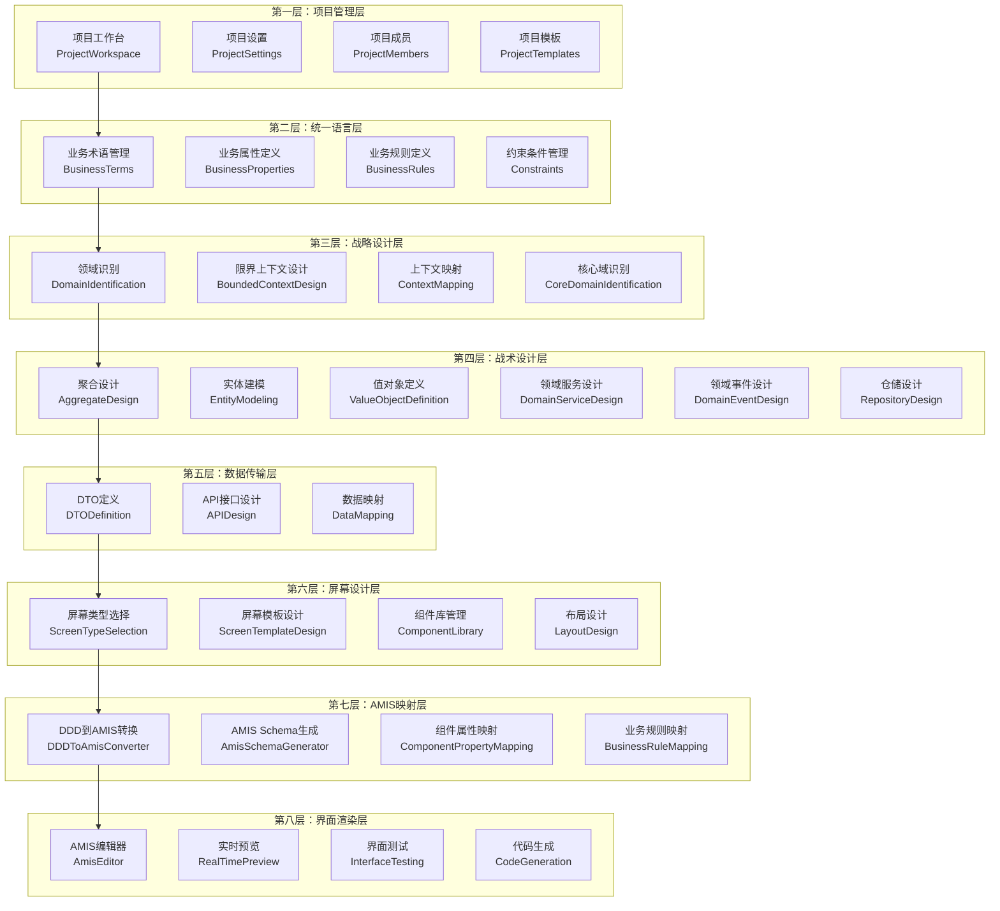
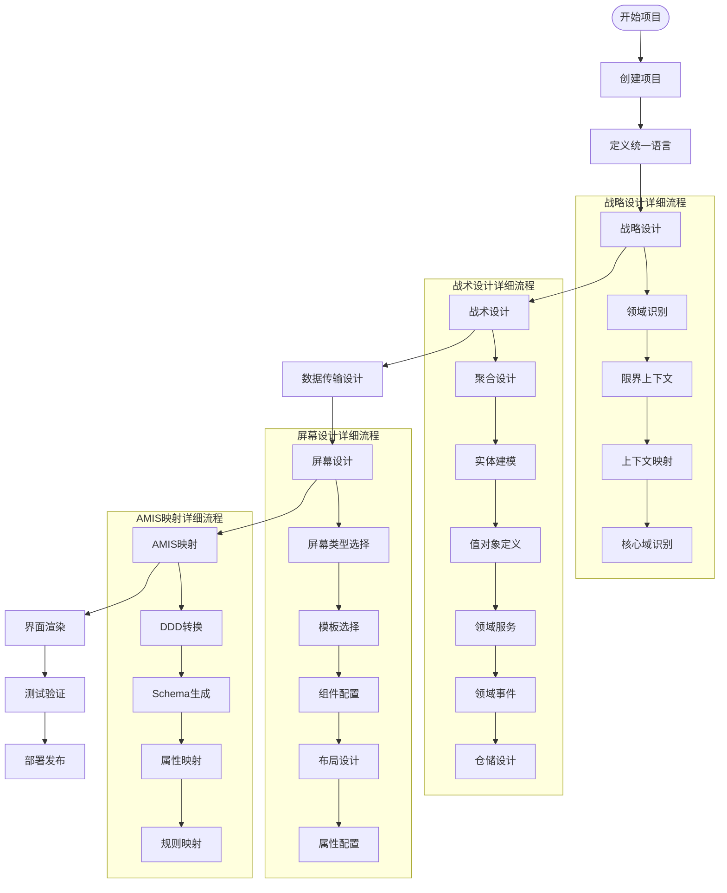

# DDD驱动开发平台前端 - 详细开发计划

## 📋 项目概述

### 项目目标
基于DDD元数据驱动的可视化开发平台前端应用，实现从DDD设计到界面实现的全自动化开发流程。

### 核心价值
- **DDD驱动**：基于领域驱动设计的完整建模工具
- **可视化设计**：拖拽式界面设计和实时预览
- **自动化生成**：从DDD模型到AMIS界面的自动转换
- **代码生成**：多框架代码自动生成能力
- **企业级架构**：生产就绪的项目结构和规范

### 技术栈
- **前端框架**：React 18 + TypeScript
- **UI组件库**：Ant Design 5.x
- **低代码框架**：AMIS 6.3.0 + amis-editor 6.3.0
- **状态管理**：Redux Toolkit + RTK Query
- **构建工具**：Vite 4.x
- **样式方案**：Less + CSS Modules

## 🏗️ 架构设计

### 8层分层架构



### 数据流设计



## 📅 开发里程碑

### 第一阶段：基础架构搭建（1-2周）

#### 目标
建立项目基础架构，实现核心页面和基础功能。

#### 任务清单
- [ ] **项目基础架构**
  - [x] 项目初始化和依赖安装
  - [x] TypeScript配置和类型定义
  - [x] Redux Store和API服务配置
  - [x] 路由和布局组件
  - [ ] 错误处理和加载状态管理
  - [ ] 国际化支持

- [ ] **核心页面开发**
  - [x] 工作台页面（Dashboard）
  - [ ] 项目管理页面（Project）
  - [ ] DDD设计页面（DDD）
  - [ ] 界面设计页面（Screen）
  - [ ] 代码生成页面（Generation）
  - [ ] 系统设置页面（Settings）

- [ ] **基础组件库**
  - [x] 应用布局组件（AppLayout）
  - [ ] 通用表格组件（DataTable）
  - [ ] 通用表单组件（DataForm）
  - [ ] 通用对话框组件（DataModal）
  - [ ] 通用卡片组件（DataCard）
  - [ ] 通用状态组件（StatusTag）

#### 交付物
- 可运行的基础前端应用
- 完整的页面导航和布局
- 基础组件库
- API服务集成

### 第二阶段：项目管理功能（1-2周）

#### 目标
实现完整的项目管理功能，包括项目CRUD、成员管理、权限控制等。

#### 任务清单
- [ ] **项目管理模块**
  - [ ] 项目列表页面
  - [ ] 项目创建向导
  - [ ] 项目详情页面
  - [ ] 项目设置页面
  - [ ] 项目删除和归档

- [ ] **项目成员管理**
  - [ ] 成员列表管理
  - [ ] 成员邀请功能
  - [ ] 角色权限管理
  - [ ] 成员操作日志

- [ ] **项目模板系统**
  - [ ] 模板库管理
  - [ ] 模板创建和编辑
  - [ ] 模板应用功能
  - [ ] 模板分享和导入导出

#### 交付物
- 完整的项目管理功能
- 项目成员和权限管理
- 项目模板系统

### 第三阶段：DDD建模功能（3-4周）

#### 目标
实现完整的DDD建模功能，包括统一语言、战略设计、战术设计等。

#### 任务清单
- [ ] **统一语言管理**
  - [ ] 业务术语管理
  - [ ] 业务属性定义
  - [ ] 业务规则定义
  - [ ] 约束条件管理
  - [ ] 术语关系图

- [ ] **战略设计工具**
  - [ ] 领域识别和分类
  - [ ] 限界上下文设计
  - [ ] 上下文映射关系
  - [ ] 核心域识别
  - [ ] 领域关系图

- [ ] **战术设计工具**
  - [ ] 聚合设计器
  - [ ] 实体建模器
  - [ ] 值对象定义器
  - [ ] 领域服务设计器
  - [ ] 领域事件设计器
  - [ ] 仓储设计器

- [ ] **可视化建模**
  - [ ] 拖拽式建模界面
  - [ ] 关系图绘制
  - [ ] 模型验证和检查
  - [ ] 模型导出和导入

#### 交付物
- 完整的DDD建模工具
- 可视化建模界面
- 模型验证和检查功能

### 第四阶段：数据传输设计（1-2周）

#### 目标
实现数据传输对象设计和API接口设计功能。

#### 任务清单
- [ ] **DTO设计器**
  - [ ] DTO定义和编辑
  - [ ] DTO字段映射
  - [ ] DTO验证规则
  - [ ] DTO转换规则

- [ ] **API接口设计**
  - [ ] RESTful API设计
  - [ ] API端点定义
  - [ ] API文档生成
  - [ ] API测试工具

- [ ] **数据映射管理**
  - [ ] 数据转换规则
  - [ ] 数据验证规则
  - [ ] 数据同步机制

#### 交付物
- DTO设计工具
- API接口设计工具
- 数据映射管理功能

### 第五阶段：屏幕设计功能（3-4周）

#### 目标
实现基于DDD模型的屏幕设计功能，包括屏幕类型选择、模板设计、组件配置等。

#### 任务清单
- [ ] **屏幕类型管理**
  - [ ] 屏幕类型定义
  - [ ] 屏幕模板库
  - [ ] 屏幕模式管理
  - [ ] 屏幕继承关系

- [ ] **屏幕设计器**
  - [ ] 拖拽式屏幕设计
  - [ ] 组件库管理
  - [ ] 布局设计工具
  - [ ] 属性配置面板

- [ ] **组件库系统**
  - [ ] 基础组件库
  - [ ] 业务组件库
  - [ ] 自定义组件
  - [ ] 组件属性配置

- [ ] **模板系统**
  - [ ] 屏幕模板管理
  - [ ] 模板创建和编辑
  - [ ] 模板应用和继承
  - [ ] 模板分享机制

#### 交付物
- 完整的屏幕设计工具
- 组件库和模板系统
- 拖拽式设计界面

### 第六阶段：AMIS映射引擎（2-3周）

#### 目标
实现DDD模型到AMIS Schema的自动转换和映射功能。

#### 任务清单
- [ ] **DDD到AMIS转换器**
  - [ ] 实体到组件转换
  - [ ] 聚合到屏幕转换
  - [ ] DTO到表单转换
  - [ ] 仓储到API转换

- [ ] **AMIS Schema生成器**
  - [ ] Schema模板引擎
  - [ ] 组件生成器
  - [ ] 布局生成器
  - [ ] 验证规则生成器

- [ ] **属性映射系统**
  - [ ] 组件属性映射
  - [ ] 验证规则映射
  - [ ] 行为规则映射
  - [ ] 样式规则映射

- [ ] **业务规则映射**
  - [ ] 业务规则转换
  - [ ] 约束条件映射
  - [ ] 验证规则映射
  - [ ] 工作流规则映射

#### 交付物
- DDD到AMIS的自动转换引擎
- AMIS Schema生成器
- 属性映射和规则映射系统

### 第七阶段：界面渲染功能（2-3周）

#### 目标
实现AMIS编辑器集成、实时预览、界面测试等功能。

#### 任务清单
- [ ] **AMIS编辑器集成**
  - [ ] 原生amis-editor集成
  - [ ] DDD语义属性面板
  - [ ] 双模式编辑支持
  - [ ] 编辑器扩展功能

- [ ] **实时预览系统**
  - [ ] 多设备预览
  - [ ] 响应式预览
  - [ ] 实时数据绑定
  - [ ] 预览状态管理

- [ ] **界面测试工具**
  - [ ] 单元测试生成
  - [ ] 集成测试工具
  - [ ] 端到端测试
  - [ ] 性能测试工具

- [ ] **代码生成功能**
  - [ ] 前端代码生成
  - [ ] 后端代码生成
  - [ ] 数据库脚本生成
  - [ ] API文档生成

#### 交付物
- 完整的AMIS编辑器集成
- 实时预览和测试工具
- 多框架代码生成功能

### 第八阶段：优化和完善（1-2周）

#### 目标
系统优化、性能提升、用户体验改进。

#### 任务清单
- [ ] **性能优化**
  - [ ] 代码分割和懒加载
  - [ ] 缓存策略优化
  - [ ] 渲染性能优化
  - [ ] 网络请求优化

- [ ] **用户体验优化**
  - [ ] 界面交互优化
  - [ ] 操作流程优化
  - [ ] 错误处理优化
  - [ ] 帮助文档完善

- [ ] **测试和文档**
  - [ ] 单元测试完善
  - [ ] 集成测试完善
  - [ ] 用户文档编写
  - [ ] 开发文档完善

- [ ] **部署和发布**
  - [ ] 生产环境配置
  - [ ] 部署脚本编写
  - [ ] 监控和日志
  - [ ] 版本发布管理

#### 交付物
- 优化后的生产就绪应用
- 完整的测试和文档
- 部署和发布方案

## 🔧 技术实现方案

### 组件设计模式

#### 1. 容器组件模式
```typescript
// 容器组件：负责数据获取和状态管理
const ProjectContainer: React.FC = () => {
  const { data: projects, loading, error } = useGetProjectsQuery();
  const [createProject] = useCreateProjectMutation();
  
  return (
    <ProjectView
      projects={projects}
      loading={loading}
      error={error}
      onCreateProject={createProject}
    />
  );
};

// 展示组件：负责UI渲染和用户交互
const ProjectView: React.FC<ProjectViewProps> = ({
  projects,
  loading,
  error,
  onCreateProject,
}) => {
  // UI渲染逻辑
};
```

#### 2. 自定义Hook模式
```typescript
// 业务逻辑封装在自定义Hook中
const useProjectManagement = () => {
  const { data: projects } = useGetProjectsQuery();
  const [createProject] = useCreateProjectMutation();
  const [updateProject] = useUpdateProjectMutation();
  const [deleteProject] = useDeleteProjectMutation();
  
  const handleCreateProject = async (projectData: ProjectData) => {
    try {
      await createProject(projectData).unwrap();
      message.success('项目创建成功');
    } catch (error) {
      message.error('项目创建失败');
    }
  };
  
  return {
    projects,
    handleCreateProject,
    handleUpdateProject,
    handleDeleteProject,
  };
};
```

#### 3. 高阶组件模式
```typescript
// 权限控制高阶组件
const withPermission = (WrappedComponent: React.ComponentType, permission: string) => {
  return (props: any) => {
    const { user } = useSelector((state: RootState) => state.auth);
    
    if (!user?.permissions.includes(permission)) {
      return <AccessDenied />;
    }
    
    return <WrappedComponent {...props} />;
  };
};
```

### 状态管理策略

#### 1. Redux Toolkit + RTK Query
```typescript
// API服务定义
export const api = createApi({
  reducerPath: 'api',
  baseQuery: fetchBaseQuery({
    baseUrl: '/api',
    prepareHeaders: (headers, { getState }) => {
      const token = (getState() as RootState).auth.token;
      if (token) {
        headers.set('authorization', `Bearer ${token}`);
      }
      return headers;
    },
  }),
  tagTypes: ['Project', 'Domain', 'Aggregate'],
  endpoints: (builder) => ({
    getProjects: builder.query<Project[], void>({
      query: () => 'projects',
      providesTags: ['Project'],
    }),
    createProject: builder.mutation<Project, CreateProjectRequest>({
      query: (project) => ({
        url: 'projects',
        method: 'POST',
        body: project,
      }),
      invalidatesTags: ['Project'],
    }),
  }),
});
```

#### 2. 本地状态管理
```typescript
// 使用useState管理组件本地状态
const [selectedProject, setSelectedProject] = useState<Project | null>(null);
const [isModalVisible, setIsModalVisible] = useState(false);
const [formData, setFormData] = useState<FormData>({});
```

### 错误处理策略

#### 1. 全局错误处理
```typescript
// 全局错误边界
class ErrorBoundary extends React.Component<Props, State> {
  constructor(props: Props) {
    super(props);
    this.state = { hasError: false, error: null };
  }
  
  static getDerivedStateFromError(error: Error): State {
    return { hasError: true, error };
  }
  
  componentDidCatch(error: Error, errorInfo: ErrorInfo) {
    console.error('Error caught by boundary:', error, errorInfo);
    // 发送错误报告到监控系统
  }
  
  render() {
    if (this.state.hasError) {
      return <ErrorFallback error={this.state.error} />;
    }
    
    return this.props.children;
  }
}
```

#### 2. API错误处理
```typescript
// RTK Query错误处理
const handleApiError = (error: any) => {
  if (error.status === 401) {
    // 未授权，跳转到登录页
    navigate('/login');
  } else if (error.status === 403) {
    // 权限不足
    message.error('权限不足');
  } else if (error.status >= 500) {
    // 服务器错误
    message.error('服务器错误，请稍后重试');
  } else {
    // 其他错误
    message.error(error.data?.message || '操作失败');
  }
};
```

### 性能优化策略

#### 1. 代码分割
```typescript
// 路由级别的代码分割
const Project = lazy(() => import('@pages/Project'));
const DDD = lazy(() => import('@pages/DDD'));
const Screen = lazy(() => import('@pages/Screen'));

// 组件级别的代码分割
const AmisEditor = lazy(() => import('@components/AmisMapping/AmisEditor'));
```

#### 2. 缓存策略
```typescript
// RTK Query缓存配置
export const api = createApi({
  // ... 其他配置
  keepUnusedDataFor: 60, // 60秒后清理未使用的数据
  refetchOnMountOrArgChange: 30, // 30秒后重新获取数据
  refetchOnFocus: true, // 窗口获得焦点时重新获取
  refetchOnReconnect: true, // 网络重连时重新获取
});
```

#### 3. 虚拟滚动
```typescript
// 大列表虚拟滚动
import { FixedSizeList as List } from 'react-window';

const VirtualizedList: React.FC<{ items: any[] }> = ({ items }) => {
  const Row = ({ index, style }: { index: number; style: React.CSSProperties }) => (
    <div style={style}>
      <ListItem item={items[index]} />
    </div>
  );
  
  return (
    <List
      height={600}
      itemCount={items.length}
      itemSize={80}
      width="100%"
    >
      {Row}
    </List>
  );
};
```

## 📊 质量保证

### 代码质量
- **ESLint**：代码规范检查
- **Prettier**：代码格式化
- **TypeScript**：类型安全检查
- **Husky**：Git钩子检查

### 测试策略
- **单元测试**：Jest + React Testing Library
- **集成测试**：API集成测试
- **端到端测试**：Cypress
- **视觉回归测试**：Chromatic

### 性能监控
- **Bundle分析**：webpack-bundle-analyzer
- **性能指标**：Core Web Vitals
- **错误监控**：Sentry
- **用户行为分析**：Google Analytics

## 🚀 部署方案

### 开发环境
```bash
# 安装依赖
npm install

# 启动开发服务器
npm run dev

# 代码检查
npm run lint

# 运行测试
npm run test
```

### 生产环境
```bash
# 构建生产版本
npm run build

# 预览生产版本
npm run preview

# 部署到服务器
npm run deploy
```

### Docker部署
```dockerfile
FROM node:18-alpine as builder
WORKDIR /app
COPY package*.json ./
RUN npm ci --only=production
COPY . .
RUN npm run build

FROM nginx:alpine
COPY --from=builder /app/dist /usr/share/nginx/html
COPY nginx.conf /etc/nginx/nginx.conf
EXPOSE 80
CMD ["nginx", "-g", "daemon off;"]
```

## 📈 项目指标

### 开发指标
- **代码覆盖率**：> 80%
- **类型覆盖率**：> 95%
- **构建时间**：< 2分钟
- **包大小**：< 2MB

### 性能指标
- **首屏加载时间**：< 3秒
- **交互响应时间**：< 100ms
- **内存使用**：< 100MB
- **CPU使用率**：< 50%

### 用户体验指标
- **页面可用性**：> 99.9%
- **错误率**：< 0.1%
- **用户满意度**：> 4.5/5
- **功能完成度**：> 95%

## 🔄 持续集成

### CI/CD流程
1. **代码提交**：Git push触发CI
2. **代码检查**：ESLint + TypeScript检查
3. **单元测试**：Jest测试运行
4. **构建测试**：生产构建验证
5. **部署测试**：测试环境部署
6. **生产部署**：生产环境部署

### 自动化工具
- **GitHub Actions**：CI/CD流水线
- **Docker**：容器化部署
- **Kubernetes**：容器编排
- **Nginx**：反向代理和静态文件服务

---

## 📝 总结

本开发计划基于8层DDD驱动架构，从项目管理到界面渲染的完整开发流程，预计总开发周期为12-16周。通过分阶段实施，确保每个阶段都有明确的交付物和质量标准，最终构建一个生产就绪的DDD驱动开发平台前端应用。

### 关键成功因素
1. **架构设计**：清晰的8层架构和模块化设计
2. **技术选型**：现代化的技术栈和最佳实践
3. **质量保证**：完善的测试和代码质量检查
4. **用户体验**：直观的界面设计和流畅的交互体验
5. **性能优化**：高效的渲染和数据处理
6. **可维护性**：清晰的代码结构和文档

### 风险控制
1. **技术风险**：amis-editor集成复杂度
2. **进度风险**：功能复杂度可能超出预期
3. **质量风险**：测试覆盖不足
4. **性能风险**：大数据量处理性能问题

通过合理的风险控制和持续的质量保证，确保项目能够按时交付高质量的DDD驱动开发平台前端应用。


